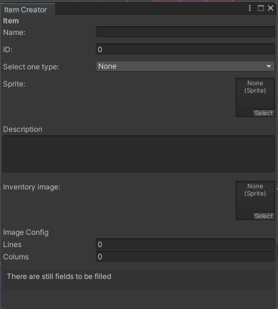
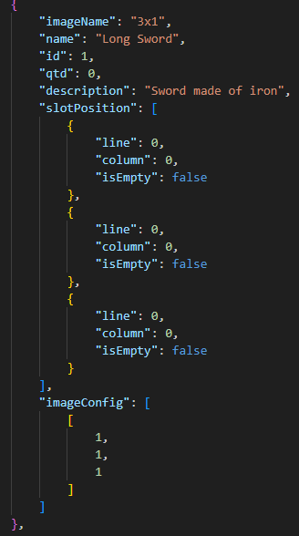

README

Link to the Project Board:

https://github.com/users/Mizuiky/projects/11/views/1

Tags:
- v1.0  https://github.com/Mizuiky/TetrisInventory/releases/tag/v1.0
  - Tool to add items, but without being able to edit them yet.
  - Creation of the inventory dynamically.
  - Rotation of the created item (without changing the item's position).
  - Adding only a single piece to the inventory.
  - Addition of a button to open and close the inventory.
  - Addition of prefabs through the item creation tool.

  - There is a bug here: when adding the piece to the inventory, the logic to increment the quantity in Tag v1.0 was not adjusted.

## 

- v1.1 https://github.com/Mizuiky/TetrisInventory/releases/tag/v1.1

- Bug fix
  - Increase item quantity in inventory when adding one instead of increasing it in the item manager.
  - Inventory boundary area created.
  - More than one piece can be fitted into the inventory.
  - The inventory item can move to any of the slots as long as it follows the inventory boundaries.
  - Inventory items can be selected and can only move when selected.
  - Inventory items are not highlighted with the same selection of the inventory slot when they are selected.
  - When inventory items are selected, they change to yellow color and slightly change their position to give a 3D effect that the piece has risen.
  - Update the JSON with new fields.

  #### Note: When adding an item to the inventory, updating the item quantity in the JSON is missing.

## 

 - v1.2 https://github.com/Mizuiky/TetrisInventory/releases/tag/v1.2

 ##

#### Obs: Ao adicionar um item no inventario, falta fazer a atualizacao da quantidade do item no json.

---

## Supreme Tile Inventory

(Disclaimer: Essa 'documentação' só está em portugues porque é mais simples de explicar. Normalmente, faria em ingles.)

### Basic Idea:

An inventory that can contain items of various different sizes, and can be organized among them. In the end, the inventory itself becomes a mini puzzle for the player, making the game more strategic than just Hermione's bag.

### Observations:
Inside the Resources folder in Assets/Resources/SaveData, I left the clean inventory JSON and the configuration of the added items.
I was using the persistent data path on my PC, but since it will be different on yours, you just need to update the JSONs created in persistentData path + SaveData/ using the JSONs from the Resources folder.
My persistent data path here is: C:\Users\gabri\AppData\LocalLow\DefaultCompany\Inventory\SaveData

---

## Discovery:
This is obviously more difficult than it seems, precisely because the items need to maintain a way to 'fit' into the inventory, so that it knows which piece is in each place, enabling other pieces to also fit.

The first approach was to try using colliders for the pieces, so that they couldn't touch each other, but this didn't work so well because, for example, using an L-shaped image, the collider would cover the entire image, which is a rectangle, and not just the L shape itself, so I discarded this possibility.

A second approach was to use matrices for the inventory and for the item configuration. This way, each piece would have its own "configuration" that it assumes in the inventory (eliminating the problem with transparency). And the inventory, in turn, can always determine which piece can fit into each place.

Computationally, this is not performative (doing several loops in a matrix), but since the overall size of the inventory is not large despite being configurable, I don't think it will be a problem. The only downside (so far) is that the code ends up being much more complex.

## Adding the first piece to the inventory:

The idea was for each new item added, to create a configuration formed by 0s and 1s where 1 represents in the configuration matrix the location where there is a 64x64 square that makes up the piece, so following the example of the L-shaped piece, it would be:

|   A   |   B   |   C   |
|-------|-------|-------|      
| 0,0   | 0,1   | 0,2   |       
| 1,0   | 1,1   | 1,2   |       

# = L    

|   A   |   B   |   C   |
|-------|-------|-------|      
|   1   |   0   |   0   |       
|   1   |   1   |   1   |  

### 1 - Slot Availability Check:
- We iterate through each slot in the inventory to check if it's available, meaning it doesn't have any items added to it.

### 2 - Configuration Check of the Item:
- If the slot is available, we check if the item's configuration can fit starting from that slot. We calculate the number of available columns and rows from the checked slot.

### 3 - Determination of Available Columns and Rows:
- We calculate the available columns from the current slot by subtracting the current column from the total number of columns in the inventory. We calculate the available rows from the current slot by subtracting the current row from the total number of rows in the inventory.

### 4 - Item Configuration Constraints:
- If the number of columns in the item's configuration matrix is greater than the available columns, it's not possible to add the item. 
- If the number of rows in the item's configuration matrix is greater than the available rows, it's not possible to add the item.

### 5 - Item Fitting Logic
a. If the value in the item's configuration is zero (indicating an empty position for the item, as in the "L" example):
- We add the current position to the list of positions.
- If it's in the last column of the item's configuration:
  - We adjust the inventory's column auxiliar to the initial column.
  - We continue the check in the next columns when the row changes.

#### Otherwise:
- We increment the current column and move to the next iteration in the item's configuration

b. If we find the number one in the configuration and the position of the inventory in the current row and column has a different item than the current item in the configuration and my current item I want to add is different from the attached item in the slot:

- It means the inventory slot is occupied.

  b.1 If there isn't a conflict detected on this slot being checked:
  - it continues to the next iteration. 
  
  #### Otherwise:

 - The position is added to the list of positions.
 - A boolean indicating that there is a conflict is activated.
 - it moves to the next iteration

- We move to the next inventory position to check if the configuration fits.

c. If the slot is available:
- We add this new position to the list of positions.
- We increment the column by moving to the next one.
- If we're in the last column of the item's configuration matrix:
  - In the next iteration, we switch rows, adjust the current column to the initial column.
  - We increment the row auxiliar for the inventory.
  - Current slot is stored for later use.

### 6 - Instantiation and Addition of the Item:

- We instantiate the item, updating data and properties.
- A new random color is added.
- The item's position is set based on the current slot and the dimensions of the inventory slot.
- We add the item to each position in the list of previously found positions: 
  - If the current position's configuration is empty we set it empty flag to true and go to the next position fo the list.

  #### Otherwise:

  - If the current position's configuration isnt empty, we set it empty flag to false.
  - However, while iterating through all the slot positions, if there are conflicts with another item, we cannot change its slot position, so we simply continue to iterate.

-  O item é adicionado à lista de itens no inventário.

### 7 - Update and Save:

- The item is added to the list of items in the inventory. We update the data of both the item and the inventory, which are then passed to the Item Manager.
- The Item Manager will call the Save Manager to update this data in the JSON later on.

---

## Tool for Adding New Items:

Fields:

- Item Name
- ID
- Type (None, Material, Weapon, Ammo, Consumable)
- Sprite (item sprite)
- Item Description
- Inventory Image (select one of the pieces within the folder Assets/UI/InventoryItems)
- Image Configuration (configuration in matrix format of the inventory piece)
- Rows
- Columns

Once all fields are filled, a button will appear to create the item.

- The item builder creates prefabs with the settings set for a normal item and an inventory item, storing these prefabs in the folder Resources/Prefabs/InventoryItems and Resources/Prefabs/Items.

- The data of the created items is saved in JSON files within the path C:\Users[Your User]\AppData\LocalLow\DefaultCompany\Inventory\SaveData.

- The file referring to the items is called ItemData, and for the inventory ones, InventoryItemData.

- When the game is started, the data from these files is loaded, and each of the item and inventory item prefabs is also loaded. The corresponding data of each is then matched, and the item manager adds these items and data to lists for easy access.

### Button on the toolbar to open the tool

### Tool to create items

### Example of the configuration of the created item within the JSON

---

## Tool to Create the Inventory

Here we have an Inventory Builder, which creates a new inventory based on fields.

Fields:

- Slot prefab that makes up the inventory
- Parent to attach the inventory to the UI
- Sprite for the normal slot
- Sprite for the highlighted slot
- Initial x position
- Initial y position
- Number of rows
- Number of columns

For each index of the row and column matrix, a new slot is instantiated at the x, y position. Additionally, the slot is initialized with its index position and saved data. After the matrix is complete, the inventory is initialized with its slots, parent, and set in the UIController, which will then pass it to the InventoryController.

---

## Rotating Items

- Pressing the Space key rotates the piece 90 degrees to the right.(but is commented because it sets a wrong position for each item we try to rotate)

### Note: The change in the configuration matrix position when the item is rotated to enable fitting is not yet implemented. 
- Perhaps, if necessary, the transpose matrix should be used.

---

## To spawn the first item:

- In the Hierarchy, fill in the fields of the Inventory Builder to create a new inventory.
- Start the game.
- In the Spawner prefab, enter a number from 0 to 17, which represents the quantity of items registered.
- In the game scene, click on the pink Spawn item button.
- The inventory starts at position x: -240 ,y: 200 with 6 rows and 10 columns.

## To add and move pieces in the inventory:

For adding, we need to use the constant:

### Vector3(wImg/2 - wSlot/2, -hImg/2 + hSlot/2) which fits the piece.
### The new position is the current slot position plus the constant on both the x and y axes, as follows:

var newPosition = new Vector3(slot.Position.x + _constant.x, slot.Position.y + _constant.y, _rect.localPosition.z);

where:

- wSlot = Width do Slot.
- hSlot = Height do Slot.

For movement, we use:

- Right: local position + wSlot on the x-axis

- Left: local position - wSlot on the x-axis

- Up: local position + hSlot on the y-axis

- Down: local position - hSlot on the y-axis

- We handle border cases by blocking movement when encountered. 
- If movement to the next position is possible, we assign it to a new variable. 
- Then, we check for conflicts where the UI controller listens to call the inventory controller for verification.

- To add an item to the next position, we employ the same method as used for initial item addition, checking each item configuration. 
- Old positions from current inventory slots are removed if they are empty and have a different item from the one currently being checked.
- We update the new positions for each slot in the item. If a conflict is detected, we refrain from removing the current item from the slot being checked to maintain consistency.
- Item manager is updated with the inventory item list. 
- If a conflict occurs while checking the next slots, a flag is set to change the color of the current item to red.

#### Example of adding and moving pieces:
- id 4 (3x2c) - Treasure chest key
- id 6 (3x5) - Blue diamond chest
- id 9 (1x1) - HP Potion
- id 10 (1x1) - MP Potion
---

## Tasks to be done  

### Continuation of the item creation tool but now for editing

Add continuation of the item creation tool, but now to enable editing. It's possible to edit via JSON, but it's not practical for game designers. So, a new tool that could fetch the list of available items and set them in a field to choose the item by its ID would be helpful. 

All items should appear for editing, and in the end, an update button that not only updates in the item manager but also updates in the JSON through the save manager would be ideal.

I could have used Scriptable Objects, but I believe a tool is more intuitive for a game designer.

---

### Improving the visual representation of the piece mapping matrix  

- The matrix of 1s and 0s maps the fields of the piece that are not transparent.
- It would be nice to be able to add rows and columns, and they would form the shape of the matrix visually in the tool for the game designer. This way, they would only fit each block to form the piece. 
- In the example of the L shape, they would add 64x64 blocks of the image only where there are blocks in the L piece. It would be a more visual way of mapping.
---

### Saving the data of each inventory slot to load them at the beginning of the game:

---

### Ideally, saving the JSON with the data of the items and inventory items on a server and loading them from there. Once the data is loaded, it should be saved in the persistent data path, which will be the path to the user's computer.

---

### Make item Rotate, and dont change it position, following the inventory slots.

---

